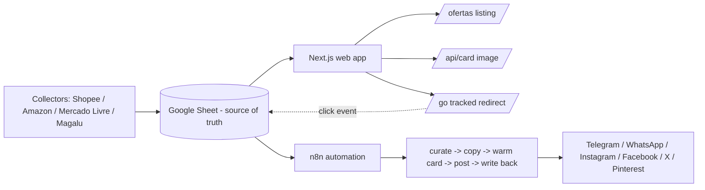

# Promopiza

> Automated affiliate-deals aggregator that curates e-commerce promotions and auto-publishes them across six social channels, with on-the-fly generated promo cards and per-channel click tracking.

**Live:** https://promopiza.online

Promopiza (a play on "pizza" + a capybara mascot) finds discounted products from Brazilian marketplaces (Shopee, Amazon, Mercado Livre, Magalu), scores and curates them, and publishes the best deals automatically to Telegram, WhatsApp, Instagram (feed + stories), Facebook, X and Pinterest. The web app is the public storefront: it lists the active offers and generates a unique, channel-optimized promo image for every product.

---

## Engineering highlights

- **Dynamic social cards at the edge.** `GET /api/card/[id]` renders a branded product card as a PNG using Next.js OG image generation (Satori), producing **three aspect ratios from a single route** via a `?f=` query param: square `1:1` (feed), `9:16` (stories) and `2:3` (Pinterest), each with format-specific typography and safe areas.
- **Image-format normalization.** Marketplace images that ship as `.webp` (which Satori cannot decode) are rewritten to `.jpg` so the product photo always renders.
- **Spreadsheet as a database.** A published Google Sheet (CSV) is the single source of truth; the app fetches and parses it with PapaParse and caches via Next.js ISR.
- **Non-blocking tracked redirects.** `GET /go/[id]?canal=...` logs the click to a webhook using Next.js `after()` and then 302s to the affiliate link, giving per-channel attribution without slowing the redirect.
- **Multi-channel automation (n8n).** A separate n8n pipeline reads the same sheet, applies scoring + diversity/anti-repeat rules, generates copy, "warms" the card endpoint to dodge serverless cold starts, posts to each channel and writes the status back to the sheet (per-channel dedup).

## Tech stack

- **Next.js 16** (App Router) + **React 19**
- **TypeScript**
- **Tailwind CSS 4**
- **next/og (Satori)** for server-side image generation
- **PapaParse** for CSV parsing
- **Google Sheets** (data) + **n8n** (automation, runs on a separate instance)
- Deployed on **Vercel**

## Architecture



## Project structure

```
app/
  page.tsx           # landing page
  ofertas/           # offers listing + filters
  api/card/[id]/     # dynamic OG promo card (feed / story / pin)
  go/[id]/           # tracked affiliate redirect (Next.js after())
  links/             # bio-links page
  privacidade/       # privacy policy
lib/
  offers.ts          # data layer: Sheets CSV -> typed Offer[] (+ helpers)
```

## Running locally

```bash
git clone https://github.com/mateuspizini/promopiza-site.git
cd promopiza-site
npm install
cp .env.example .env.local   # then fill in the values
npm run dev
```

Open http://localhost:3000.

### Environment variables

| Variable | Description |
| --- | --- |
| `PROMOPIZA_SHEET_CSV_URL` | Published Google Sheet CSV URL (the offers source of truth) |
| `NEXT_PUBLIC_PROMOPIZA_WHATSAPP_URL` | WhatsApp channel link |
| `NEXT_PUBLIC_PROMOPIZA_TELEGRAM_URL` | Telegram channel link |

If `PROMOPIZA_SHEET_CSV_URL` is not set, the app falls back to bundled mock offers so it still renders.

## Card formats

| Format | URL | Size | Used for |
| --- | --- | --- | --- |
| Feed | `/api/card/<id>` | 1080x1080 | Instagram/Facebook feed |
| Story | `/api/card/<id>?f=story` | 1080x1920 | Instagram stories |
| Pin | `/api/card/<id>?f=pin` | 1000x1500 | Pinterest |

## License

MIT - see [LICENSE](./LICENSE).
